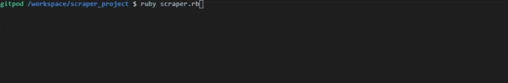

# Scraper_Project  for Microverse

- in this project I did Scrape a web page for my capstone Project in Ruby.

# Demo Images




# live Demo link

- live demo link : (https://d22b14f2-a858-4397-92d8-041468e22a58.ws-eu01.gitpod.io/#/workspace/scraper_project)


# This project has four milestones
- Project setup
- Scraper logic
- Instruction How to use it

### Project Structure

```bash 
├── .github/workflow
│   └── linters.yml
|   └── test.yml
├── bin
│   └── main.rb
├── lib
│   └── scraper.rb
│   └── table.rb
│
├── spec
|   └── spec_helper.rb
│   └── scraper_table_spec.rb
|   └── scraper_spec.rb
|
├── .rspec
├── .rubocop.yml
├──  Gemfile
├──  Gemfile.lock
├── README.md
```

# how to Run the repo 

- downlod the repo from here : (https://github.com/dasileker/scraper_project/tree/features)

- clone the repo go to Git bash & enter git clone: (https://github.com/dasileker/scraper_project.git)

- Go to cd scraper_project 

- type bundle install

- type cd bin

- and type ruby scraper.rb


# how to Run the Rspec

- Go to cd scraper_project 

- type bundle install

- type gem install Rspec

- and type rspec

# Demo Images


# conclusion

- as you can see i did scrape another website callet torrent website to fetch all you want from the search query, from videos to filme name  or even company name of pdf file, and it gives you the total of link fitched at the end of the search query. 


## Authors:
👤 Amine

* dasileker (https://github.com/dasilekr)
* zerradi amine (https://linkedin.com/dasileker)

## Show your support

Give a ⭐️ if you like this project!
